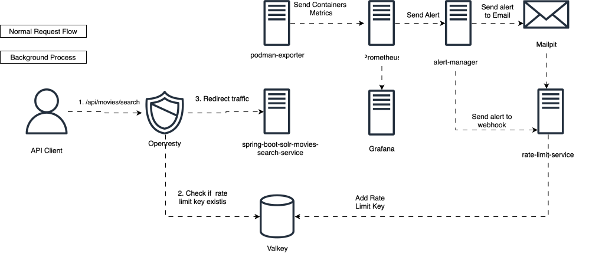

## Hi, I am Marco Pedroza 👋

I'm a software developer interested in building backend systems, specially with Spring Boot and the broader Java ecosystem.

This repository is my personal space for learning, experimenting and documenting what I learn, which often turns into articles on Medium.

## 🛠️ Technologies 
* ☕ [Java] * 🌱 [Spring Boot] * 📦 [Podman] * 🔄 [Kafka] * 🔍[Solr] * 🦙 [Ollama] * 🧪 [JMeter] * 📊 [Prometheus] * 📈[Grafana] * 🗄️ [MongoDB]

## 📝 Latest Articles

### 🛡️ Building a High-Performance Event-Driven Rate Limiter with OpenResty, Valkey(Redis) & Prometheus

---

### 🤖 Building a Local RAG System with Spring Boot, Ollama and Apache Solr: A Practical Guide Approach

---

### 🤖 How to Implement Semantic Search with Ollama, Spring Boot and Solr: A Comprehensive Tutorial

---

### 🔄 Building an Idempotent Kafka Consumer with Spring Boot and Apache Solr: A Practical Approach

[Java]: https://www.java.com/
[Spring Boot]: https://spring.io/projects/spring-boot
[Podman]: https://podman.io/
[Kafka]: https://kafka.apache.org/
[Solr]: https://solr.apache.org/
[Ollama]: https://ollama.com/
[JMeter]: https://jmeter.apache.org/
[Prometheus]: https://prometheus.io/
[Grafana]: https://grafana.com/
[MongoDB]: https://www.mongodb.com/